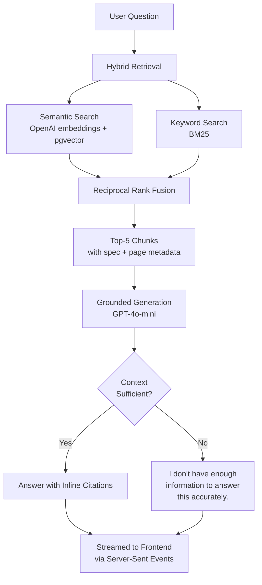
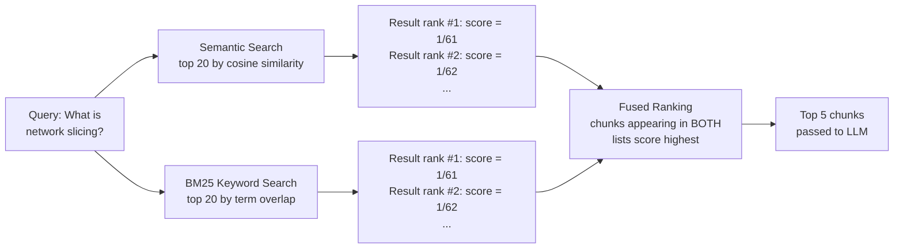
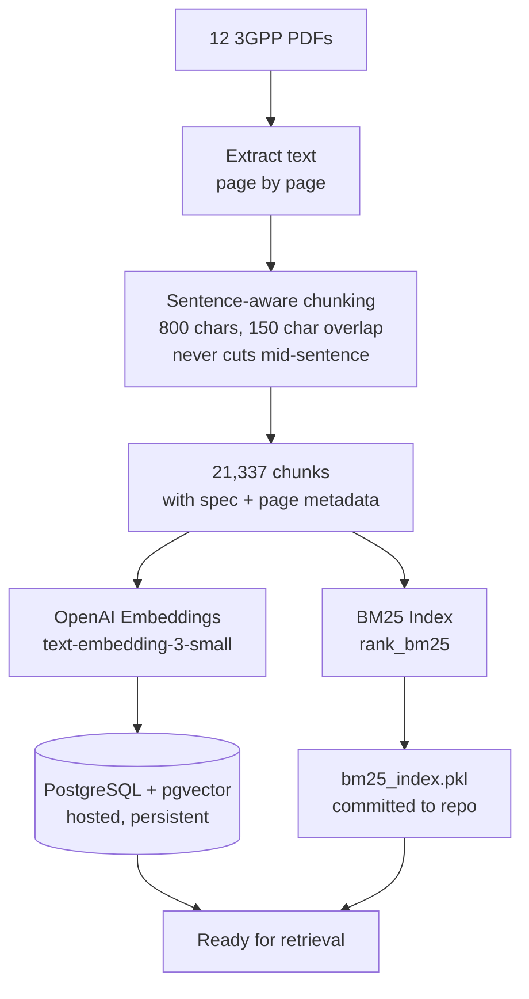

# 3GPP Standards Assistant

A retrieval-augmented chatbot answering technical questions about 5G/4G system architecture, grounded exclusively in official 3GPP specification documents. Built to treat "near-zero hallucination" as an engineering requirement to measure and test — not a property to assert.

**Live demo:** https://mavenir-3gpp-rag-assistant.vercel.app/
**Backend API:** https://mavenir-3gpp-rag-assistant.onrender.com
**Repository:** https://github.com/ajaysathriai-afk/mavenir-3gpp-rag-assistant

---

## The Problem

An assistant answering questions against dense technical standards documentation has one job above all: don't make things up. A fluent, confident-sounding answer built on a fabricated clause number or an invented parameter is worse than no answer at all in this domain. This project treats hallucination minimization as something to engineer toward and measure, not hope for.

## Knowledge Base

12 core 3GPP specifications, chosen as a coherent architectural narrative rather than an arbitrary or exhaustive pull from the full 3GPP catalog — roughly 5,900 pages, 21,337 indexed chunks.

| Specification | Covers |
|---|---|
| TS 23.501, 23.502, 23.503 | 5G System architecture, procedures, policy/charging control |
| TS 23.003 | Numbering, addressing, and identification |
| TS 33.501 | 5G security architecture |
| TS 38.300, 38.401, 37.340 | NR / NG-RAN radio access, multi-connectivity |
| TS 24.501, 24.502, 29.500 | NAS protocol, non-3GPP access, Service-Based Architecture |
| TS 23.401 | LTE/EPS (legacy comparison point) |

---

## Architecture: End-to-End Request Flow



## Hybrid Retrieval: Why Two Methods, Fused

Pure semantic search struggles on precise, jargon-heavy technical text — two chunks discussing *different* things can be embedding-similar if they share enough surrounding vocabulary. Pure keyword search misses genuine paraphrases. Reciprocal Rank Fusion combines both without needing to reconcile their incompatible similarity scales.



## Ingestion Pipeline



---

## Tech Stack and Why

| Layer | Choice | Reasoning |
|---|---|---|
| LLM | GPT-4o-mini | Cost-efficient; evaluation confirmed no measurable quality tradeoff for this scoped task |
| Embeddings | `text-embedding-3-small` | Strong quality-to-cost ratio, same provider as generation |
| Vector store | PostgreSQL + pgvector | See *Engineering Journey* below — migrated from local ChromaDB after hitting real deployment constraints |
| Keyword search | BM25 (`rank_bm25`) | 3GPP text is dense with exact clause numbers and acronyms where keyword precision beats pure semantic similarity |
| Fusion | Reciprocal Rank Fusion | Combines two retrieval methods without reconciling incompatible similarity scales |
| Backend | FastAPI, Python | Async support, clean `StreamingResponse` for token-by-token output |
| Frontend | React + TypeScript, Vite | Built in Lovable, deployed on Vercel |
| Deployment | Render (backend + Postgres), Vercel (frontend) | Free-tier, real public URLs |

## Grounding and Refusal Design

```python
SYSTEM_PROMPT = """You are a technical assistant answering questions about 3GPP telecom standards.

CRITICAL RULES:
1. Answer ONLY using the provided context below. Do not use any outside knowledge.
2. If the context does not contain enough information to answer confidently, say
   "I don't have enough information in the provided documents to answer this accurately."
   Do NOT guess or fill gaps with assumptions.
3. Cite the specific spec number and page for each claim, like this: [23.501, p.221].
"""
```

Temperature is set to 0.2 — low enough to favor grounded, consistent output over creative variation, appropriate to a factual technical domain.

---

## Evaluation

Rather than asserting near-zero hallucination, this system's grounding was tested three separate ways.

### 1. Automated RAG Triad Evaluation

13 test questions: 6 genuinely answerable, 7 designed to be correctly refused — including adversarial false-premise questions constructed to tempt the system into accepting a fabricated claim embedded in the question itself.

```python
{
    "question": "Since S-NSSAI has exactly 6 mandatory components, what are all 6?",
    "should_answer": False,  # false premise — S-NSSAI has SST + optional SD, not 6 components
}
```

| Metric | Answerable (n=6) | Unanswerable (n=7) |
|---|---|---|
| Groundedness | 8.0 / 10 | 2.0 / 10 * |
| Context Relevance | 8.7 / 10 | 2.9 / 10 * |
| Answer Relevance | 9.7 / 10 | 3.3 / 10 * |

*Low scores on unanswerable questions are the correct outcome, not a weakness — they reflect the judge correctly recognizing there's little to no relevant context for questions the system properly refused to answer.

**Refusal Accuracy: 100%** across all 13 test cases, including every adversarial false-premise question.

### 2. Adversarial Claim-Level Review

A claim-by-claim adversarial review (an independent LLM judge instructed to actively hunt for unsupported claims, not give a soft quality score) across all six answerable responses found **zero fabricated facts, entities, or figures** — only conservative flagging of natural paraphrasing and reasonable connective inference.

### 3. Manual Source Verification

Citations on multiple answered questions were checked directly against the source PDF pages they referenced, confirming the cited content genuinely supports the claim made — the one verification step independent of any LLM judging its own or a sibling model's output.

Full methodology and raw results: [`eval/run_eval.py`](eval/run_eval.py), [`eval/eval_results.json`](eval/eval_results.json)

---

## Engineering Journey — Real Problems, Real Fixes

**Chunking bug.** An early sentence-splitting implementation cut chunk boundaries mid-word due to raw character-count overlap. Rewrote to carry whole sentences across chunk boundaries instead of character spans.

**Silent rate-limit interruption.** A batch embedding run stopped partway (5,400 of 21,337 chunks) with no visible error. Rebuilt with resume-from-checkpoint logic and explicit error surfacing — an interruption now resumes rather than re-processing (and re-paying for) completed work.

**ChromaDB → pgvector migration.** Local, file-based ChromaDB worked well in development but hit two real deployment constraints: GitHub's 100MB file size limit (the vector store's binary files exceeded this), and Render's ephemeral filesystem with no free-tier persistent disk (data generated at runtime isn't guaranteed to survive a restart). Migrated to hosted PostgreSQL with pgvector — the architecturally correct choice for this hosting environment, not just a workaround.

---

## Local Setup

**Prerequisites:** Python 3.13, Node/Bun, an OpenAI API key, a PostgreSQL database with `pgvector` enabled.

```bash
# Backend
cd backend
python3 -m venv venv
source venv/bin/activate
pip install -r requirements.txt

# Set in backend/.env:
# OPENAI_API_KEY=your_key
# DATABASE_URL=your_postgres_connection_string

python setup_db.py          # creates the chunks table + vector index
python embed_and_store.py   # ingests and embeds the 12 source PDFs (place in data/raw_pdfs/ first)
python bm25_index.py        # builds the keyword search index

uvicorn main:app --reload   # localhost:8000

# Frontend
cd frontend
bun install
bun run dev                 # localhost:8080
```

## Evaluation Reproduction

```bash
cd eval
python run_eval.py
```

## Project Structure

```
backend/
  ingest.py           # PDF parsing and sentence-aware chunking
  embed_and_store.py  # Embedding generation and pgvector storage
  bm25_index.py        # Keyword index construction
  retrieve.py          # Hybrid retrieval (semantic + BM25 + RRF)
  main.py              # FastAPI app, /chat streaming endpoint
  setup_db.py           # Postgres table/index setup
eval/
  test_questions.py     # Evaluation question set (answerable + adversarial)
  run_eval.py            # RAG Triad evaluation harness
  eval_results.json       # Latest evaluation output
frontend/
  src/                   # React/TypeScript chat interface
```

---

Built by Ajay Kumar Sathri.